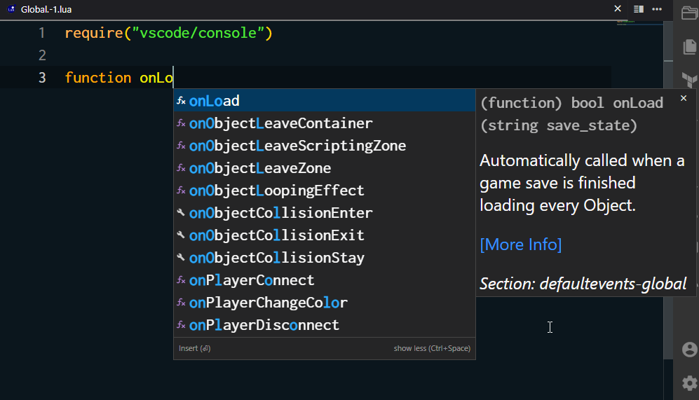
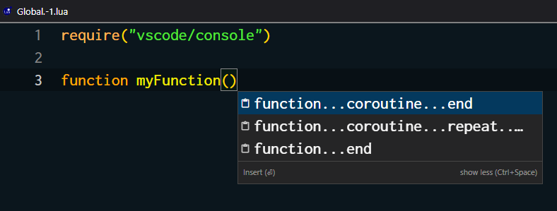
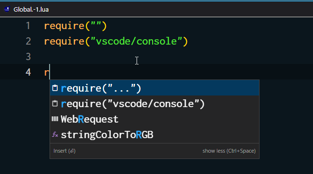
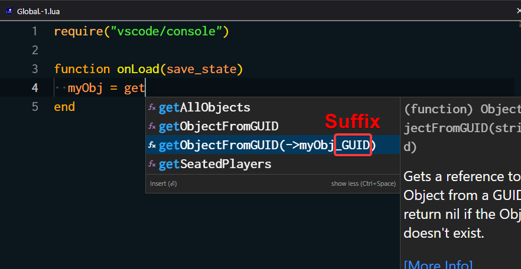
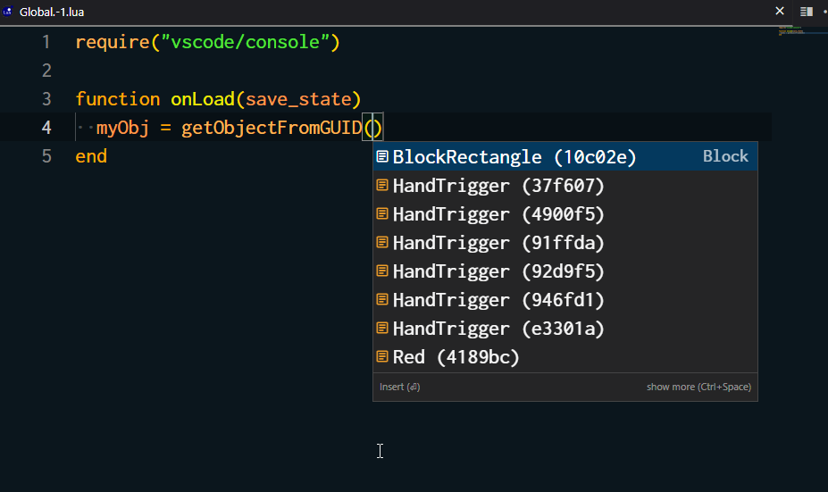
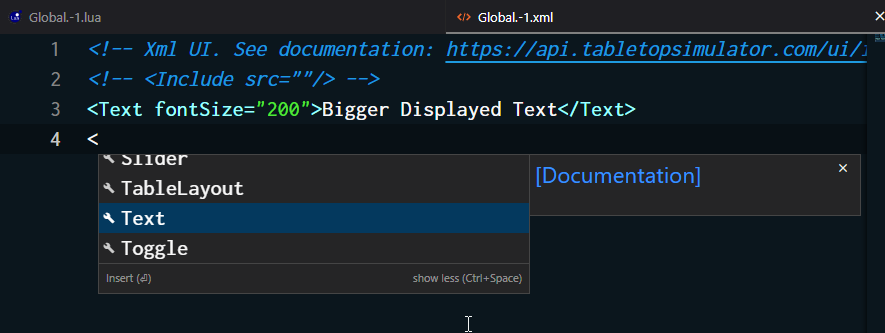

# Lua and XML Autocompletion

This extension features autocompletion for both Lua and XML, here's how to use it.

## Lua

Lua autocompletion is built upon the same provider file that powers the official Atom Plugin, so it should be familiar to most users. The extension will try to guess the type of the variable, and will provide a list of functions and properties that are available for that type. This will also happen for function names and parameters, so you can get a list of parameters for a function by typing the function name and opening the autocomplete list. <kbd class="kbc-button-sm">Ctrl</kbd>+<kbd class="kbc-button-sm">Space</kbd> will also trigger the autocomplete list.

Also note that the documentation for the function will be displayed in the tooltip, so you can get a quick reference of what the function does. Toggle between the documentation and the signature by pressing <kbd class="kbc-button-sm">Ctrl</kbd>+<kbd class="kbc-button-sm">Space</kbd> again.

The `[More Info]` link will redirect you to the official documentation for that function.

### Coroutine Snippets

The extension also provides snippets for coroutines, so you can quickly create a coroutine and start it. The snippets are triggered after a function definition like so:

### Require Snippets

The extension also provides snippets for `require` statements, so you can quickly require a file. The snippets are triggered when you start writing a `require` statement like so:

### getObjectFromGUID Snippets

There are 2 autocompletion items for `getObjectFromGUID` the first one takes a variable name as a parameter along with a suffix and the second will scan the current file for guids and suggest them as a completion items.

#### Suffixed getObjectFromGUID:
The first one is triggered by typing `getObjectFromGUID` on the right side of an assignment like so:

<!-- <callout type="info"> -->

Suffix is configurable in the [extension settings](/extension/configuration)
<!-- </callout> -->

#### Scan getObjectFromGUID:
Whereas the second one is triggered by triggering suggestions (<kbd class="kbc-button-sm">Ctrl</kbd>+<kbd class="kbc-button-sm">Space</kbd>) while inside the parenthesis of `getObjectFromGUID` 

This one works by executing a custom [Lua function](https://github.com/rolandostar/tabletopsimulator-lua-vscode/blob/main/lua/requestObjectGUIDs.lua) that requests all objects and returns the data through custom message, which is then picked up by the extension and subsequently offered as suggestions.

## XML

XML Autocompletion is a lot simpler than Lua, the suggestions are loaded from [a data array](https://github.com/rolandostar/tabletopsimulator-lua-vscode/blob/main/src/vscode/XMLCompletionData.ts) created by hand, so it's not as accurate as the Lua autocompletion, but it should be enough to get you started. 

Tag autocompletion is available, so you can get a list of tags that are available at the current level. This is triggered by typing `<` and then pressing <kbd class="kbc-button-sm">Ctrl</kbd>+<kbd class="kbc-button-sm">Space</kbd>

Attribute autocompletion is also available, so you can get a list of attributes that are available for the current tag. This is triggered by pressing <kbd class="kbc-button-sm">Space</kbd> after a Tag or another Attribute

